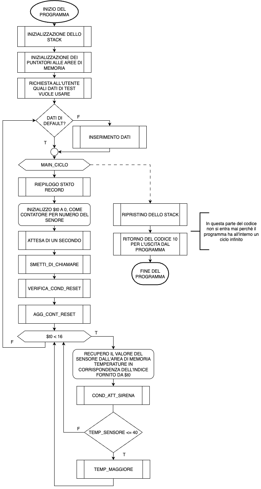
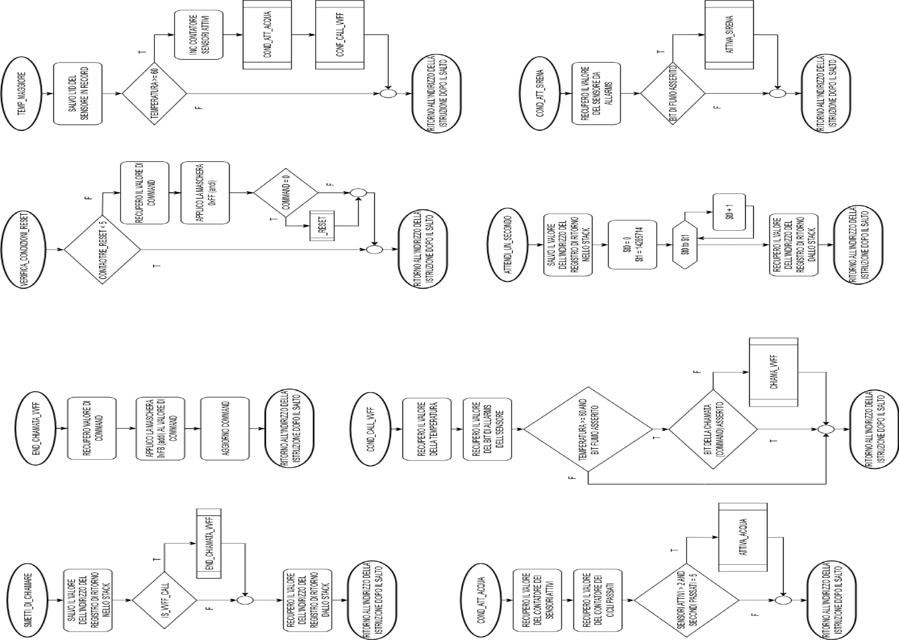
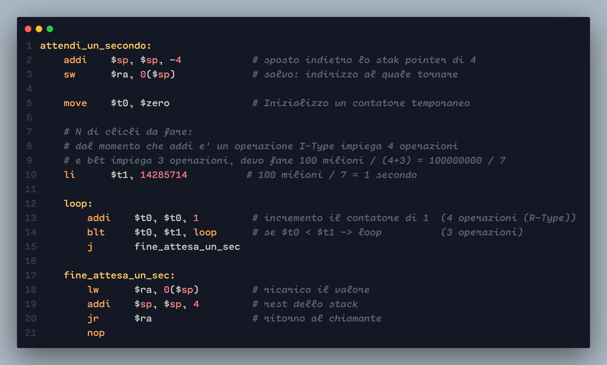
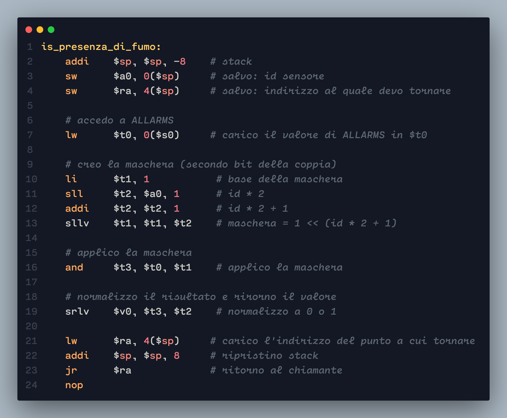
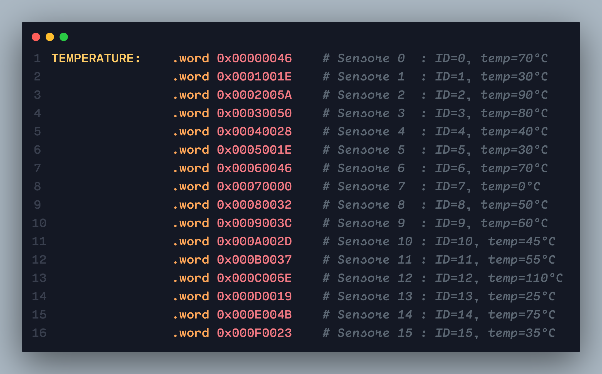
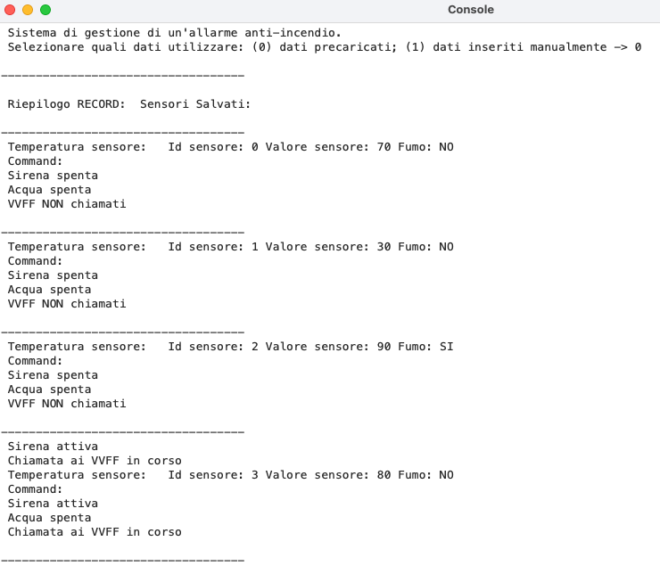
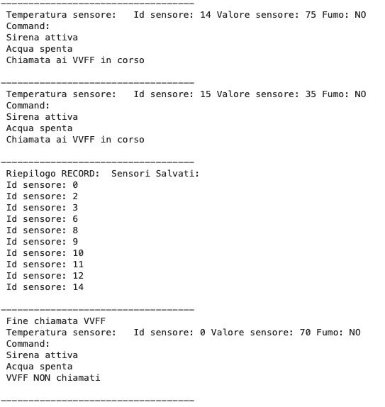
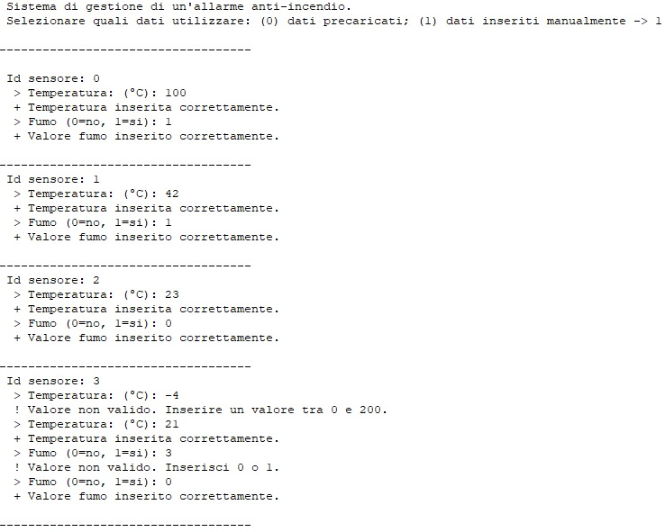
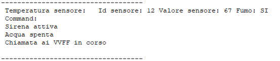
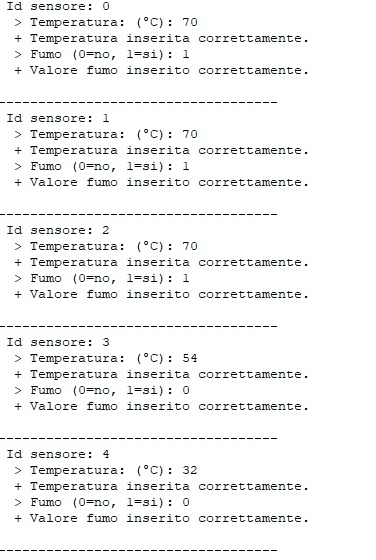

# Autori
- Niccolò Sesana
- Giovanni Gerace

# Testo del progetto
Un sistema basato sul microprocessore MIPS R2000 (clock pari a 100 MHz) gestisce un allarme anti-incendio.
Il programma di cui si chiede lo sviluppo gestisce da 1 a 16 sensori il cui stato è memorizzato nell’area di memoria denominata ALLARMS. Per ogni sensore vengono dedicati due bit consecutivi, uno che viene asserito quando la temperatura si alza sopra i 60 gradi, il secondo che viene asserito quando viene rilevata la presenza di fumo. L’area di memoria viene aggiornata ogni secondo.

Il software aziona il sistema scrivendo in una area di memoria denominata COMMAND, di tre bit, il
primo che aziona la sirena quando asserito, il secondo che attiva l’impianto di estinzione ad acqua
quando è asserito, il terzo che chiama i VVFF. Il terzo bit viene deasserito dal sistema dopo 1 secondo. 

Se viene rilevato solo fumo in almeno sensore, scatta la sirena. Se viene rilevata una temperatura
superiore ai 60 gradi in almeno due sensori, per più di 5 secondi, viene attivata l’estinzione ad acqua.
Se viene rilevato sia fumo che una temperatura superiore ai 60 gradi nello stesso sensore, viene
attivata la sirena, l’impianto di estinzione e vengono chiamati i VVFF.

Nell’area di memoria denominata TEMPERATURE vengono memorizzate dal sistema,
consecutivamente in memoria, le temperature di ogni sensore. Per ogni sensore 2 byte identificano il numero del sensore e due byte identificano la temperatura misurata.
Quando scatta l’allarme temperatura identificare i sensori con una temperatura maggiore di 40 gradi e scrivere l’elenco dei sensori nell’area di memoria RECORD.

Il sistema resetta gli allarmi e l’impianto di estinzione dopo 5 secondi senza fumo e temperatura
minore di 60 gradi in tutti i sensori.
Alle celle di memoria sopra menzionate si assegnino indirizzi arbitrari che cadano, però, nell’area dei dati dell’architettura MIPS. Il programma deve essere assemblato, linkato e sottoposto a simulazione. Si faccia una stampa commentata del sorgente del programma realizzato (corredata anche del relativo flow-chart).

# Analisi del progetto
## Analisi della memoria
Il programma deve lavorare su quattro aree di memoria, definite nella parte di intestazione
dell’applicativo dentro il campo “.data”. Le aree di memoria sono così definite:
- ALLARMS
In questa area di memoria vengono riportati gli stati dei sensori (2 bit).
I due bit indicano:
	- 1 bit: se la temperatura è maggiore di 60 gradi centigradi
	- 2 bit: presenza di fumo
Dimensione dell’area di memoria:
2 bit × 16 sensori = 32 bit = 1 word.
L’area di memoria ALLARMS contiene i dati salvati in maniera continua. Per recuperare il valore
di uno specifico sensore, bisogna scorrere l’area di memoria, di 2 bit in 2 bit, fino ad arrivare al
sensore richiesto.
	COMMAND
Questa area di memoria è composta da solo 3 bit i quali rappresentano i diversi stati del
sistema, in base alle situazioni lette nei sensori, le quali sono:
	- Bit 0: attivazione sirena
	- Bit 1: attivazione estrazione ad acqua
	- Bit 2: chiamata ai VVFF
Dal momento che questa area di memoria è di soli 3 bit, nel sistema viene dichiarata come
Byte.
- TEMPERATURE
Area di memoria contigua dove i sensori sono identificati da 1 word, la quale word è suddivisa
in: primi 2 Byte ID del sensore, restati 2 Byte valore del sensore.
2 Byte per l’Id + 2 Byte per il valore = 4 Byte = 1 Word × 16 sensori = 16 word = 64 Byte.
- RECORD:
Area di memoria contigua nella quale vengono salvati i soli ID dei sensori se la temperatura è
maggiore di 40 gradi centigradi.
2 Byte × 16 sensori = 32 Byte = 8 Word.

All’interno del programma, sempre nel segmento “.data” ad intestazione del file di progetto sono
definiti, mediante word, dei contatori globali, utilizzati tra un ciclo di lettura e un altro.
Subito dopo sono definite come costanti letterarie le stringhe che verranno stampate sulla console
durante l’esecuzione del codice nell’apposito simulatore QtSPIM.

# Diagramma di flusso

## Diagramma di flusso delle principali sub-rutine

# Implementazioni notevoli (codice MIPS)
## Tempo di attesa

Descrizione implementazione:
Per attendere un secondo tra una scansione e l’altra, dal momento che non si ha un completo
controllo sul processore MIPS R2000 (poiché siamo in un’ambiente simulato), si è deciso di
procedere nel seguente modo:
Il processore MIPS R2000 ha un clock pari a 100 milioni di istruzioni. Per simulare un secondo,
attraverso l’implementazione di un ciclo con il contatore (addi + blt), si deve sommare il numero di
cicli di clock che utilizzano addi e blt e dividere cento milioni per il risultato della somma.
$$ 1 \text{ secondo}= \frac{100 \text{ milioni di cicli}}{7 \text{ cicli}} = 14285714 \text{ 𝑐𝑖𝑐𝑙𝑖}$$

I setti cicli a denominatore si calcolano, sommano il numero di cicli che impiega l’istruzione addi ad
essere eseguita + il numero dei cicli che ci mette l’operazione blt ad essere eseguita. In questo caso l’istruzione addi impiega 4 cicli, mentre l’istruzione blt ne usa 3.
## Funzione di controllo presenza di fumo

Decrizione implementazione:
Questa funzione si occupa di verificare se il sensore ha rilevato fumo.
Per fare questa verifica, accedo all’area di memoria ALLARMS alla quale vado a prelevare il valore del bit di fumo e verifico se è asserito o deasserito.
La funzione termina restituendo al chiamante il valore normalizzato di 1 se e’ stato rilevato fumo o il valore 0 se non e’ stato rilevato.
# Esecuzione
## Dataset per il test
### Area di memoria per ALLARMS

| SENSORE | TEMP > 60 | FUMO |
| ------- | --------- | ---- |
| 0 | SI | NO |
| 1 | NO | NO |
| 2 | SI | SI |
| 3 | SI | NO |
| 4 | NO | NO |
| 5 | NO | NO |
| 6 | SI | NO |
| 7 | NO | NO |
| 8 | NO | SI |
| 9 | NO | SI |
| 10 | NO  |SI |
| 11 | NO  |SI |
| 12 | SI  |SI |
| 13 | NO  |NO |
| 14 | SI  |NO |
| 15 | NO  |NO |

Il valore esadecimale 0x03AA1071 rappresenta in un unico valore tutti gli stati che hanno i sedici
sensori.

### Area di memoria TEMPERATURE

I valori sono riportati in esadecimale, per un fattore di praticità e compattezza nel rarigurare le
informazioni. Le maschere usate all’intero del codice funzionano anche se il valore è scritto con una
notazione diversa da quella binaria.

## Output di esecuzione sulla console di QtSPIM (valori statici)
(Inizio del programma, primo ciclo e alcuni sensori)

(continuo, e inizio secondo ciclo)

I cicli successivi sono uguali, in quanto i valori sono fissi e quindi le condizioni di reset non si possono attivare.

## Output di esecuzione sulla console di QtSPIM (scelta dati e inserimento manuale)

Sono stati inseriti alcuni controlli sui dati che è possibile inserire da tastiera.

Una volta terminata il primo inserimento di dati per i 16 sensori, l’output procede come per il modello statico, adattando i messaggi di output.

Ad ogni cambio di ciclo, il programma richiede l’inserimento di nuovi valori per i sensori. In questo
modo è possibile vedere il variare delle situazioni.

